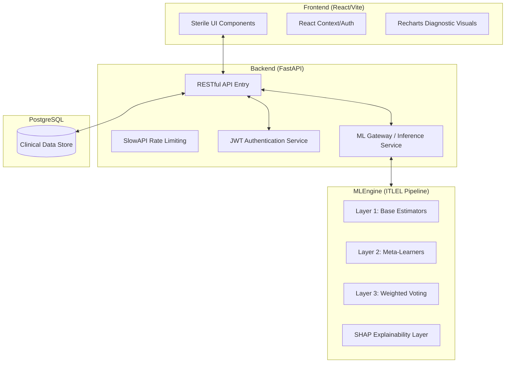

# Technical Architecture Specification: MindScreen Diagnostic Engine

This document provides a low-level technical decomposition of the MindScreen platform, focusing on the system internals, the multi-layered ensemble machine learning pipeline, and the explainability layer.

## 1. System Overview

MindScreen is architected as a decoupled, high-performance web application optimized for clinical decision support. The system leverages a **FastAPI** backend for asynchronous I/O and a **React/Vite** frontend for a high-fidelity diagnostic interface.

### 1.1 Architecture Blueprint

---

## 2. Machine Learning: ITLEL Pipeline

The core of MindScreen is the **ITLEL (Improved Transformer-based LightGBM Ensemble Learning)** model. Despite its name, the production implementation utilizes a hybrid of Gradient Boosted Decision Trees (XGBoost) and Deep Learning (TabTransformers) to capture both tabular patterns and complex feature interactions.

### 2.1 Multi-Layer Ensemble Architecture

The inference pipeline follows a strict three-layer hierarchical structure:

#### **Layer 1: Diversified Base Estimators**
- **XGB1 & XGB2**: Two distinct XGBoost classifiers trained with varied hyperparameters (max depth, learning rates) to capture non-linear tabular relationships.
- **Tab1 & Tab2**: Two TabTransformer models (Transformer-based architectures for tabular data). These utilize Multi-Head Attention mechanisms to learn internal feature embeddings ($d=32$).

#### **Layer 2: Heterogeneous Meta-Learners**
- **SVM Meta-Learner**: A Support Vector Machine (RBF Kernel) trained on the concatenated probability outputs of the XGBoost base learners.
- **KNN Meta-Learner**: A K-Nearest Neighbors $(k=5)$ algorithm trained on the concatenated probability outputs of the TabTransformer learners.

#### **Layer 3: Predictive Weighted Fusion**
The final diagnostic probability $P_{final}$ is derived via a weighted confidence fusion:
$$P_{final} = 0.6 \times P_{svm} + 0.4 \times P_{knn}$$
This weighting favors the SVM meta-learner's stability on tabular signals while incorporating the deep-learning nuances of the KNN/TabTransformer branch.

---

## 3. Explainability Layer (XAI)

MindScreen implements **Post-hoc Local Explainability** using the **SHAP (SHapley Additive exPlanations)** framework.

- **Algorithm**: `KernelExplainer`.
- **Sampling Strategy**: To maintain sub-second inference times in the backend, the explainer uses a curated background sample ($n=50$) from the training distribution.
- **Feature Attribution**: The system calculates SHAP values for all 9 PHQ-9 domains (Anhedonia, Mood, Sleep, etc.), providing a quantitative measure of how each response contributed to the final risk score.

---

## 4. Backend Gateway & Data Persistence

### 4.1 Request Lifecycle
1. **Validation**: Requests are validated against Pydantic schemas (`AssessmentSubmit`).
2. **Inference**: The `ML Gateway` loads serialized models (Joblib/Torch) and executes the ITLEL pipeline.
3. **Serialization**: High-dimension SHAP values are serialized as JSON objects and stored in the database.
4. **Authorization**: All endpoints are protected via JWT-based Role-Based Access Control (RBAC).

### 4.2 Data Models (SQLAlchemy)
| Entity | Type | Description |
| :--- | :--- | :--- |
| `User` | Auth | Stores credentials, email, and roles (Patient/Clinician). |
| `PatientMeta` | Profile | Extended clinician-facing metadata for patients. |
| `Assessment` | Transaction | Logs PHQ-9 responses, raw scores, and ML-inferred risk levels. |
| `Report` | Artifact | Stores LLM-derived recommendations and static PDF artifacts. |

---

## 5. Security & Reliability

- **Rate Limiting**: Implemented via `SlowAPI` to prevent brute-force attacks on auth and ML inference endpoints.
- **CORS Strategy**: Strict origin filtering to allow only trusted frontend domains.
- **Error Handling**: Standardized HTTP exception hierarchy for clinical reliability.
