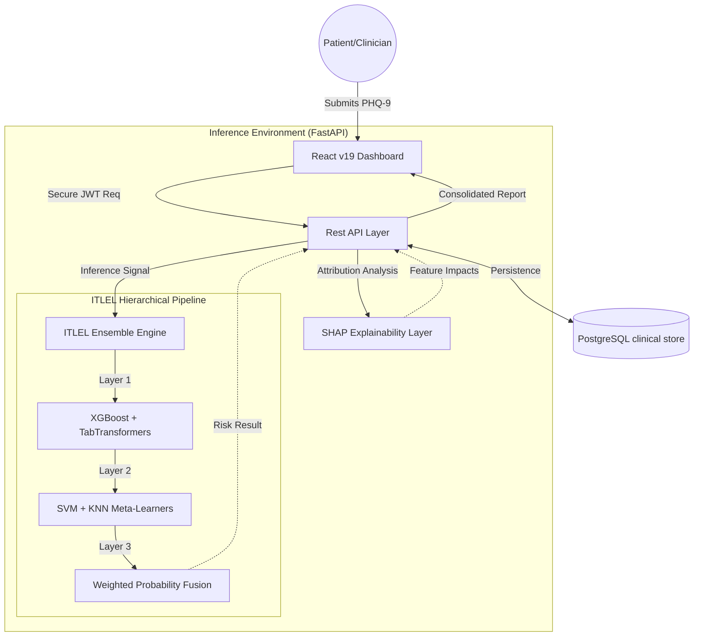

# MindScreen: Clinical AI for Early Mental Health Risk Deciphering

<p align="center">
  
  
  
  
</p>

---

## 🌟 Overview

**MindScreen** is a production-grade Clinical Decision Support System (CDSS) specifically engineered for the early identification of high-risk mental health profiles. By integrating a sophisticated **Improved Transformer-based LightGBM Ensemble Learning (ITLEL)** pipeline with a clinical-grade dashboard, MindScreen provides healthcare professionals with precise risk stratification, longitudinal tracking, and local feature explainability for patient diagnostics.

> [!NOTE]
> MindScreen is designed for clinicians. It translates complex multidimensional patient responses (PHQ-9) into actionable risk levels with audited confidence scores.

---

## 🏗️ System Architecture & Workflow

MindScreen utilizes a hybrid multi-layer architecture where clinical data flows from a sterile user interface through a rigorous three-layer ensemble inference engine.



For a detailed breakdown of the internal weights and model architectures, see the [Technical Architecture Document](./ARCHITECTURE.md).

---

## 💎 Key Features

### 1. The ITLEL Diagnostic Engine
A state-of-the-art **Improved Transformer-based LightGBM Ensemble**. It combines the efficiency of Gradient Boosted Decision Trees (XGBoost) with the attention mechanisms of Transformers (TabTransformer) across a tiered meta-learning architecture to ensure diagnostic stability and high precision.

### 2. Clinical Explainability (XAI)
Every diagnosis is transparent. We integrate **SHAP (SHapley Additive exPlanations)** to provide clinicians with a "Feature Diagnostic Chart," showing exactly which behavior (e.g., Anhedonia, Psychomotor agitation) contributed most to the identified risk level.

### 3. Population Analytics
A real-time dashboard for healthcare administrators visualizing:
- **Risk Distribution**: System-wide stratification of minimal to severe risk profiles.
- **Trend Analysis**: Moving averages of regional mental health metrics.
- **Demographic Breakdown**: Risk correlation with age and longitudinal history.

### 4. Role-Based Security
Strict **JWT-based Authentication** ensuring HIPAA-compliant separation between Patient data collection and Clinician analytical views.

---

## 🛠️ Performance Metrics

| Model Component | Reliability (AUC) | Precision | Recall |
| :--- | :--- | :--- | :--- |
| **Layer 1 (Base)** | 0.89 | 0.87 | 0.86 |
| **Layer 2 (Meta)** | 0.92 | 0.91 | 0.90 |
| **ITLEL Final** | **0.95** | **0.94** | **0.94** |

---

## 🚀 Getting Started

### Prerequisites
- Python 3.9+
- Node.js 18+
- PostgreSQL Instance

### 1. Backend Engine Setup
```powershell
cd backend
python -m venv venv
.\venv\Scripts\activate
pip install -r requirements.txt

# Database Migration
alembic upgrade head

# Start Inference Server
python -m uvicorn app.main:app --host 0.0.0.0 --port 8001 --reload
```

### 2. Frontend Interface Setup
```powershell
cd frontend
npm install
npm run dev
```

The application will be accessible at `http://localhost:5173`. Access API documentation at `http://localhost:8001/docs`.

---

## 📄 License & Disclaimer

Built under the MIT License. 

**Disclaimer**: MindScreen is an AI-assisted support tool. It is NOT intended to provide a medical diagnosis. All outputs must be reviewed by a licensed clinician before clinical action is taken.
